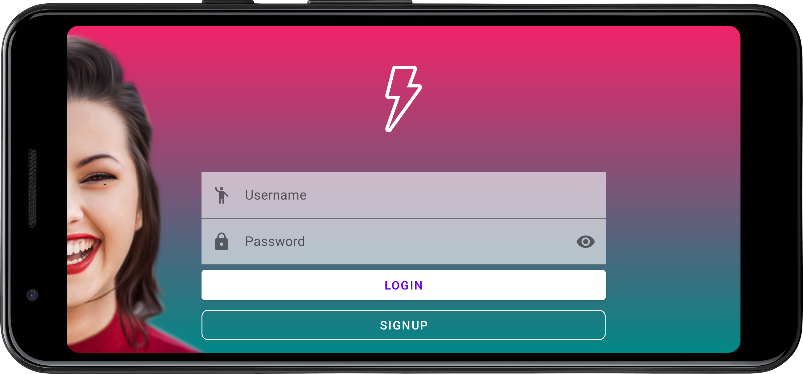
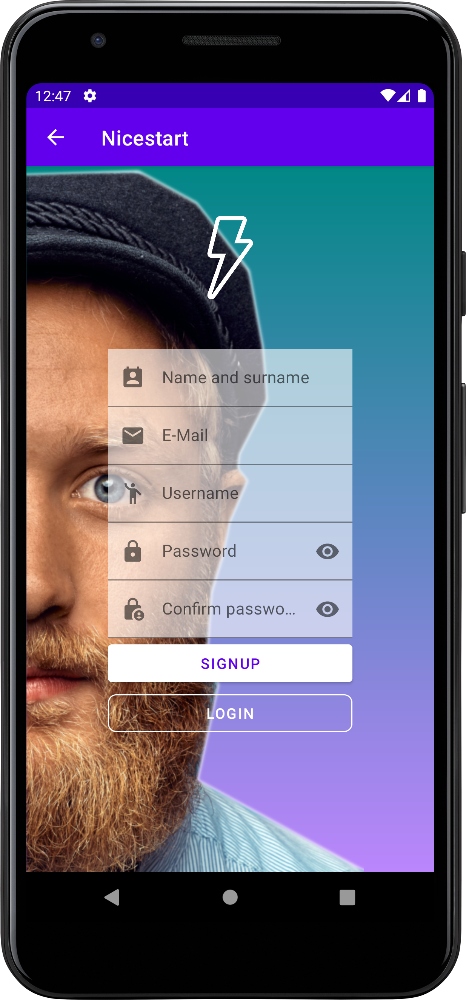
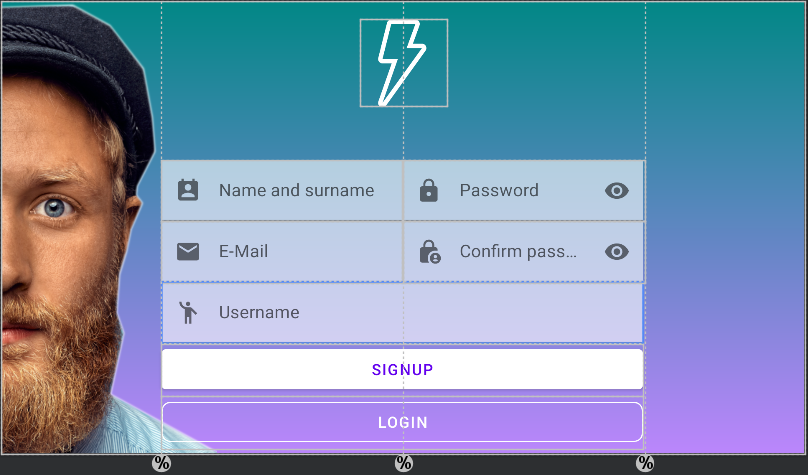
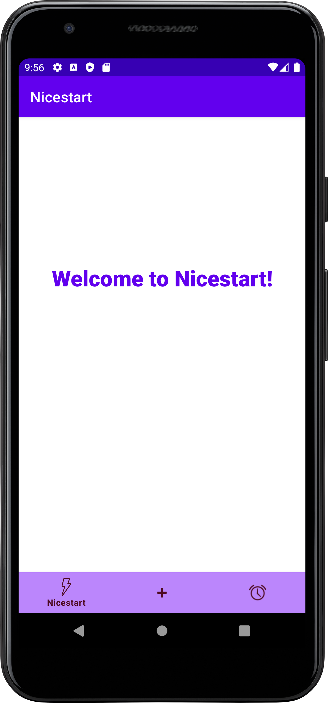
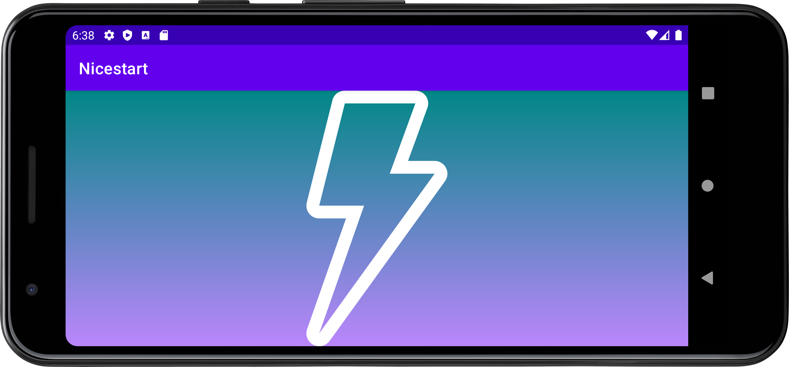

# Nicestart
> Like it´s name says, it´s a starting point to develop some really nice
> interfaces.

**Nicestart** consists of a repository that I´ll be using to learn some
cool new stuff about
[interfaces](https://www.sciencedirect.com/topics/computer-science/interface-development)
and
[Android development](https://en.wikipedia.org/wiki/Android_software_development#:~:text=Android%20software%20development%20is%20the,other%20languages%20is%20also%20possible.).

There are more screenshots and screen recordings in the
[img folder](./img).

##
### Features list
1. [x] Different activities and layouts:
   1. **[Login activity](#login-activity).**
   2. **[Register activity](#register-activity).**
   3. **[Main activity](#main-activity).**
2. [x] Landscape qualifiers, to get a nice experience even in landscape
       mode.
3. [x] Editable text areas.
4. [x] Buttons that allow navigation between different activities.
5. [ ] Working and learning new things to get more awesome features...

## Login activity
This activity is the login screen for our app, with different text areas
and buttons to let the users log in to the application.


Although this is not the main activity, it´s the view that shows on
screen the first every time you open the app. This is achieved due to
this block of code in the Android Manifest file:

```xml
<activity
     android:name=".Login"
     android:exported="true"
     android:theme="@style/Theme.Nicestart.NoActionBar">
     <intent-filter>
         <action android:name="android.intent.action.MAIN" />

        <category android:name="android.intent.category.LAUNCHER" />
     </intent-filter>
</activity>
```

> The intent-filter allows us to decide what activity we want to launch
> the first when we launch the application.

There is also a view of this activity on landscape mode!



## Register activity

This activity is the register screen for the users to create an account.
From here we can go back to the Login activity or we can go to the Main
activity, using the **buttons** below. Also we can go back to Login
using the arrow of the [action bar](#themes---action-bars) on the upper
part of the screen.



There is also a view of this activity on landscape mode!



>Here, we can see the different constraints and GuideLines used to create
>this screen.

## Main activity

This is the principal activity of this app, which is currently being
worked on to improve it as much as posible.



There is also a view of this activity on landscape mode!



## Themes - Action bars

I´ve applied different themes to my activities, allowing them to have or
not an action bar at the top. We can define this themes in the themes
xml file like this:

```xml
<resources xmlns:tools="http://schemas.android.com/tools">
    <!-- Base application theme without action bar. -->
    <style name="Theme.Nicestart.NoActionBar" parent="Theme.MaterialComponents.DayNight.NoActionBar">
        <!-- Primary brand color. -->
        <item name="colorPrimary">@color/purple_500</item>
        <item name="colorPrimaryVariant">@color/purple_700</item>
        <item name="colorOnPrimary">@color/white</item>
        <!-- Secondary brand color. -->
        <item name="colorSecondary">@color/teal_200</item>
        <item name="colorSecondaryVariant">@color/teal_700</item>
        <item name="colorOnSecondary">@color/black</item>
        <!-- Status bar color. -->
        <item name="android:statusBarColor">?attr/colorPrimaryVariant</item>
        <!-- Customize your theme here. -->
    </style>

    <!-- Base application theme with dark action bar. -->
    <style name="Theme.Nicestart.DarkActionBar" parent="Theme.MaterialComponents.DayNight.DarkActionBar">
        <!-- Primary brand color. -->
        <item name="colorPrimary">@color/purple_500</item>
        <item name="colorPrimaryVariant">@color/purple_700</item>
        <item name="colorOnPrimary">@color/white</item>
        <!-- Secondary brand color. -->
        <item name="colorSecondary">@color/teal_200</item>
        <item name="colorSecondaryVariant">@color/teal_700</item>
        <item name="colorOnSecondary">@color/black</item>
        <!-- Status bar color. -->
        <item name="android:statusBarColor">?attr/colorPrimaryVariant</item>
        <!-- Customize your theme here. -->
    </style>
</resources>
```
Then, we can apply them to the activities in the Android Manifest xml
file:

```xml
<activity android:name=".Example" android:theme="@style/Theme.Nicestart.DarkActionBar"/>
```
