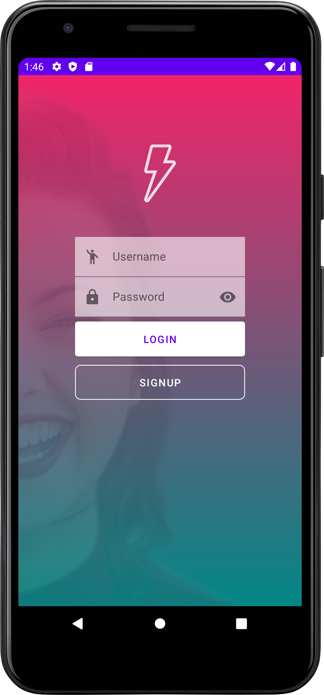
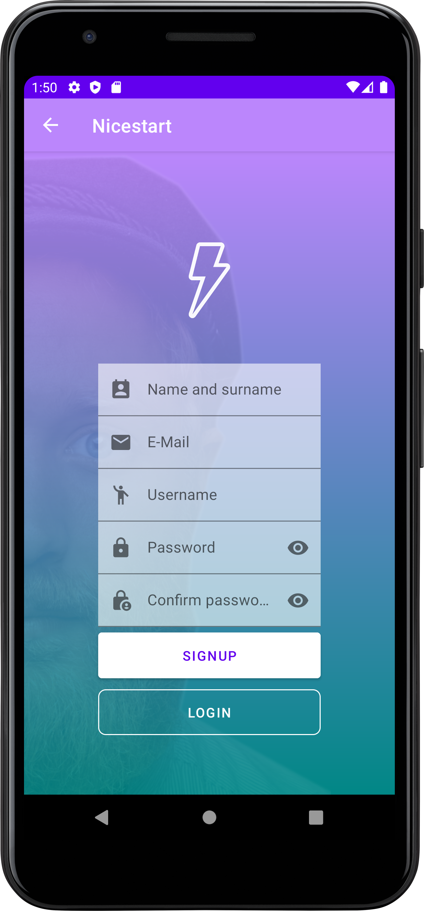
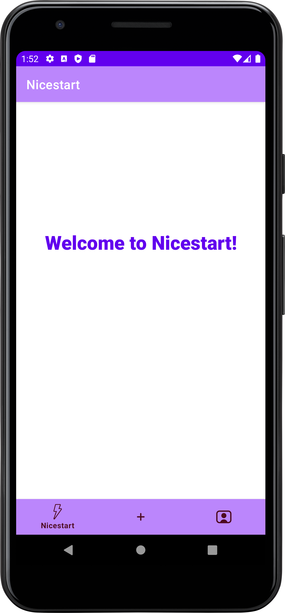
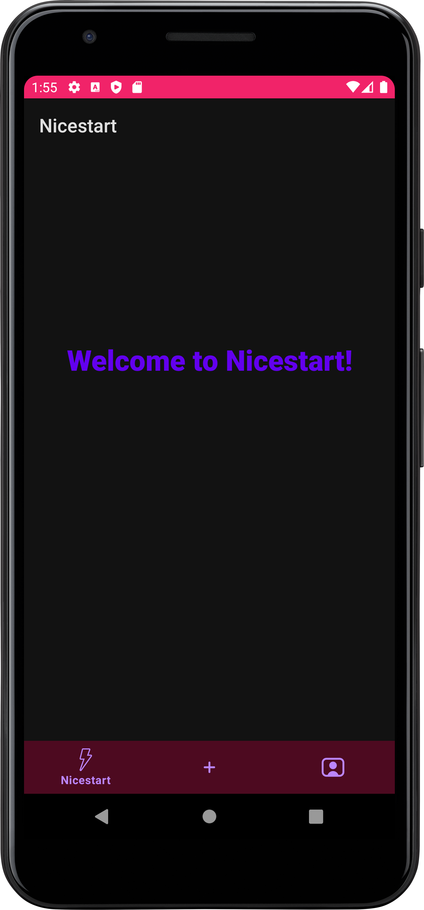
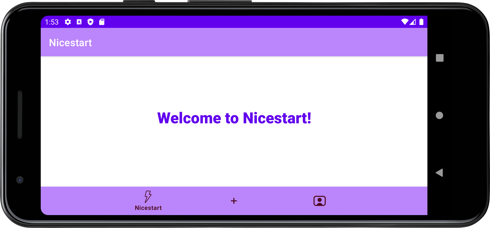
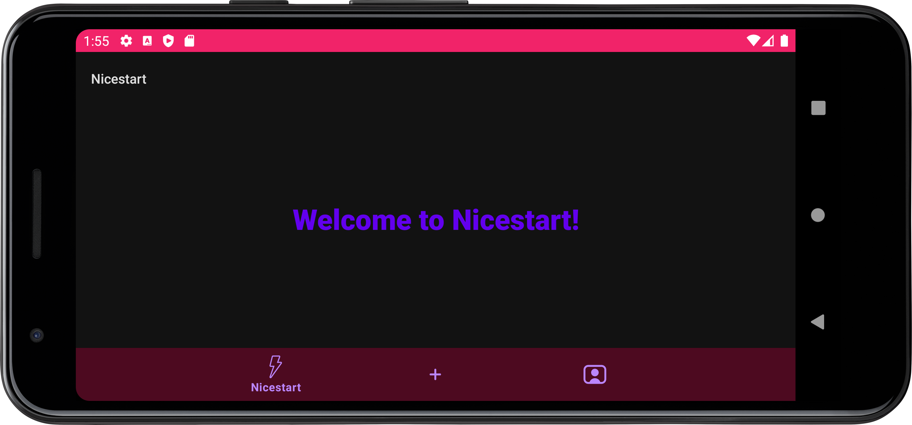
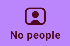

# Nicestart
> Like it´s name says, it´s a starting point to develop some really nice
> interfaces.


**Nicestart** consists of an app that I´ll be developing to learn some
cool new stuff about
[interfaces](https://www.sciencedirect.com/topics/computer-science/interface-development)
and
[Android development](https://en.wikipedia.org/wiki/Android_software_development#:~:text=Android%20software%20development%20is%20the,other%20languages%20is%20also%20possible.).

- **I've made a pull request to my teacher's repository, adding a new
Lottie animation to the login and register activities, and a new font
for the buttons. My contribution can be found
[here](https://github.com/atomms/First/tree/alejandro23).**

- **There are more screenshots and screen recordings of the app, if you
want to see them, click [here](./img) :·)**

##
### Features list
1. [x] Different activities and layouts:
   1. **[Splash activity](#splash-activity).**
   2. **[Login activity](#login-activity).**
   3. **[Register activity](#register-activity).**
   4. **[Main activity](#main-activity).**
   5. **[No people activity](#no-people-activity).**
2. [x] Landscape layouts, to get a nice experience even in landscape
       mode.
3. [x] Editable text areas.
4. [x] Buttons that allow navigation between different activities.
5. [x] Images loaded with Glide.
6. [x] Unique and colorful animations, using Lottie.
7. [x] Bottom navigation bar, to allow an intuitive navigation across the main activity.
8. [x] SwipeRefresh actions.
9. [ ] Working and learning new things to get more awesome features...

## Splash activity
This activity is the one that shows up first when we open the app. This is achieved due to
this block of code at the Android Manifest file:

```xml
<activity
     android:name=".Splash"
     android:exported="true"
     android:theme="@style/Theme.Nicestart.NoActionBar">
     <intent-filter>
          <action android:name="android.intent.action.MAIN" />
          <category android:name="android.intent.category.LAUNCHER" />
     </intent-filter>
</activity>
```

> The intent-filter allows us to decide what activity we want to launch
> the first when we open the application.

This activity is like a loading and welcome screen for our app. It contains a background image with a
cross fade animation, and an animated thunder icon like the logo of the app.


## Login activity
This activity is the login screen for our app, with different text areas
and buttons to let the users log in to the application. It has an
animated thunder (the logo of the app) that blinks.



## Register activity

This activity is the register screen for the users to create an account.
From here we can go back to the Login activity or to the Main activity,
using the **buttons** below. Also we can go back to Login using the
arrow of the [action bar](#themes---action-bars) on the upper part of
the screen. It also has the animated thunder logo on the top of the
screen.



## Main activity

This is the principal activity of this app, which is currently being
worked on to improve it as much as posible.

This activity has a [navigation bar](#navigation-bar) to navigate
between 3 different sections. It also has a specific [theme](#themes---dark-and-light-modes) for
dark mode that changes the colors of it´s palette.









## No people activity

This activity is opened by tapping on this icon, at the bottom
navigation bar:



This automatically opens a view with a SwipeRefresh action, that changes
the image of the WebView that we have on the screen, transforming the
"person" of the photo to another "person". These people actually are not
real, and they are generated by
[this page](https://thispersondoesnotexist.com). Everytime we refresh
the page, a Toast message also appears on screen.

<iframe id="iFrame_1" src="./img/Screen_recording_1.webm"></iframe>

## Themes - Action bars

I´ve applied different themes to my activities, allowing them to have or
not an action bar at the top. We can define this themes in the themes
xml file like this:

```xml
<resources xmlns:tools="http://schemas.android.com/tools">
    <!-- Base application theme without action bar. -->
    <style name="Theme.Nicestart.NoActionBar" parent="Theme.MaterialComponents.DayNight.NoActionBar">
        <!-- Primary brand color. -->
        <item name="colorPrimary">@color/purple_500</item>
        <item name="colorPrimaryVariant">@color/purple_700</item>
        <item name="colorOnPrimary">@color/white</item>
        <!-- Secondary brand color. -->
        <item name="colorSecondary">@color/teal_200</item>
        <item name="colorSecondaryVariant">@color/teal_700</item>
        <item name="colorOnSecondary">@color/black</item>
        <!-- Status bar color. -->
        <item name="android:statusBarColor">?attr/colorPrimaryVariant</item>
        <!-- Customize your theme here. -->
    </style>

    <!-- Base application theme with dark action bar. -->
    <style name="Theme.Nicestart.DarkActionBar" parent="Theme.MaterialComponents.DayNight.DarkActionBar">
        <!-- Primary brand color. -->
        <item name="colorPrimary">@color/purple_500</item>
        <item name="colorPrimaryVariant">@color/purple_700</item>
        <item name="colorOnPrimary">@color/white</item>
        <!-- Secondary brand color. -->
        <item name="colorSecondary">@color/teal_200</item>
        <item name="colorSecondaryVariant">@color/teal_700</item>
        <item name="colorOnSecondary">@color/black</item>
        <!-- Status bar color. -->
        <item name="android:statusBarColor">?attr/colorPrimaryVariant</item>
        <!-- Customize your theme here. -->
    </style>
</resources>
```
Then, we can apply them to the activities in the Android Manifest xml
file:

```xml
<activity android:name=".Example" android:theme="@style/Theme.Nicestart.DarkActionBar"/>
```

## Themes - Dark and Light modes

I edited the themes xml file, for light and for dark modes, to change
the colors of the palette when the device is on dark mode:

```xml
<!-- Primary brand color for light mode. -->
<style>
    <item name="colorPrimary">@color/purple_200</item>
    <item name="colorPrimaryVariant">@color/purple_500</item>
    <item name="colorOnPrimary">@color/white</item>
</style>
```
```xml
<!-- Primary brand color for dark mode. -->
<style>
    <item name="colorPrimary">@color/fucsia_200</item>
    <item name="colorPrimaryVariant">@color/fucsia_700</item>
    <item name="colorOnPrimary">@color/black</item>
</style>
```

## Navigation bar

I watched a video on how to do a navigation bar with different styles,
so this is the style of the one I´ve made, using the colors of the
palette of this app:

```xml
<?xml version="1.0" encoding="utf-8"?>
<RelativeLayout xmlns:android="http://schemas.android.com/apk/res/android"
    xmlns:app="http://schemas.android.com/apk/res-auto"
    xmlns:tools="http://schemas.android.com/tools"
    android:layout_width="match_parent"
    android:layout_height="match_parent"
    tools:context=".MainActivity">

    <FrameLayout
        android:id="@+id/frame_container"
        android:layout_width="match_parent"
        android:layout_height="match_parent"
        android:layout_alignParentTop="true"
        app:layout_behavior="@string/appbar_scrolling_view_behavior"/>

    <com.google.android.material.bottomnavigation.BottomNavigationView
        android:id="@+id/bottom_navigation"
        android:layout_width="match_parent"
        android:layout_height="wrap_content"
        android:layout_alignParentStart="true"
        android:layout_alignParentEnd="true"
        android:layout_alignParentBottom="true"
        android:elevation="8dp"
        app:layout_constraintBottom_toBottomOf="parent"
        app:layout_constraintStart_toStartOf="parent"
        app:layout_constraintEnd_toEndOf="parent"
        app:menu="@menu/bottom_navigation"
        app:labelVisibilityMode="selected"
        style="@style/BottomNavigation"/>

</RelativeLayout>
```

I defined the bottom navigation theme like this, in the themes xml file:

```xml
<!-- Navigation bar theme for light mode -->
<style name="BottomNavigation">
    <item name="android:background">@color/purple_200</item>
    <item name="itemIconTint">@color/fucsia_700</item>
    <item name="itemTextColor">@color/fucsia_700</item>
</style>
```
```xml
<!-- Navigation bar theme for night mode -->
<style name="BottomNavigation">
    <item name="android:background">@color/purple_700</item>
    <item name="itemIconTint">@color/fucsia_200</item>
    <item name="itemTextColor">@color/fucsia_200</item>
</style>
```
